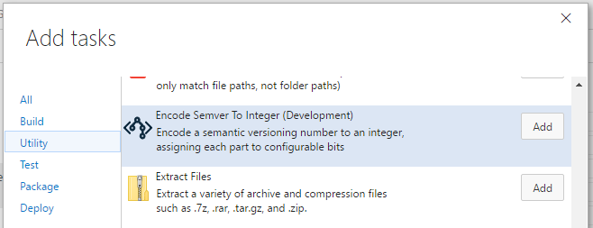

# Build and release tasks for Semantic Versioning

Visual Studio Team Services Build and Release Management extensions that help you work with semantic versioning.

[Learn more](https://github.com/geeklearningio/gl-vsts-tasks-semver/wiki) about this extension on the wiki!

## Tasks included

* **[Encode Semver To Integer](https://github.com/geeklearningio/gl-vsts-tasks-semver/wiki/Encode-Semver-To-Integer)**: Encode a semantic versioning number to an integer, assigning each part to configurable bits

## Steps

After installing the extension, you can add one (or more) of the tasks to a new or existing [build definition](https://www.visualstudio.com/en-us/docs/build/define/create) or [release definition](https://www.visualstudio.com/en-us/docs/release/author-release-definition/more-release-definition)

## Learn more

The [source](https://github.com/geeklearningio/gl-vsts-tasks-semver) for this extension is on GitHub. Take, fork, and extend.

## Release Notes

> **3-20-2017**
> - Fix few bugs and add unit tests

> **8-3-2016**
> - Added: Encode Semver To Integer
